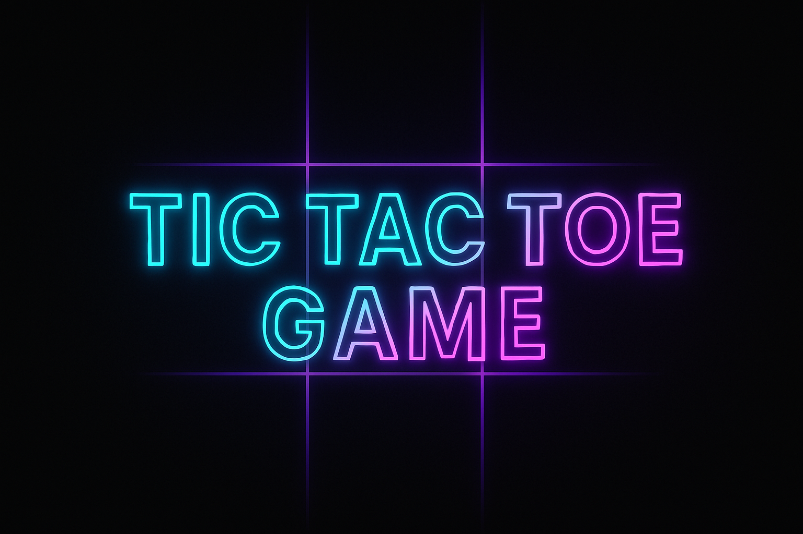

# 🎮 Tic Tac Toe Game in Python

A beginner-friendly 2-player **Tic Tac Toe** game written in Python and playable through the terminal. Perfect for practicing input handling, control structures, and basic game logic.

---

## 🛠️ Features

- 👥 Two-player turn-based gameplay
- ⛔ Invalid move handling
- ✅ Win detection for all 8 combinations
- 🤝 Graceful draw conclusion
- 🎯 Simple & clear board design

---

## 📷 Game Preview
```
|   |   |   |
-------------
|   |   |   |
-------------
|   |   |   |
```
PLAYER 1 :: Enter the move you want to play (1-9): 5
```
|   |   |   |
-------------
|   | X |   |
-------------
|   |   |   |
```

---

## 🧠 How It Works

- The board is a list of 9 positions indexed 0–8.
- Each player inputs a number from 1–9 representing a cell.
- The game checks for:
  - Win: Any row/column/diagonal with same symbol
  - Draw: When all 9 moves are made with no winner
- Player 1 uses **X** and Player 2 uses **O**.

---

## 🚀 How to Run

### 🔧 Requirements

- Python 3.x
- No external packages needed

### ▶️ Steps

1. Clone the repository:
   ```bash
   git clone https://github.com/your-username/tic_tac_toe_game.git
   cd tic_tac_toe_game
2.Run the game:
  python tic_tac_toe_game.py

Or just open the .py file in any Python IDE and hit "Run".

📁 Project Structure
tic_tac_toe_game/
│
├── tic_tac_toe_game.py    # Python game file
├── banner.png             # (Optional) Banner image
└── README.md              # This file


👩‍💻 Author
Tanya Rathour
📚 B.Tech CSE | 🎯  ML Enthisiast 


